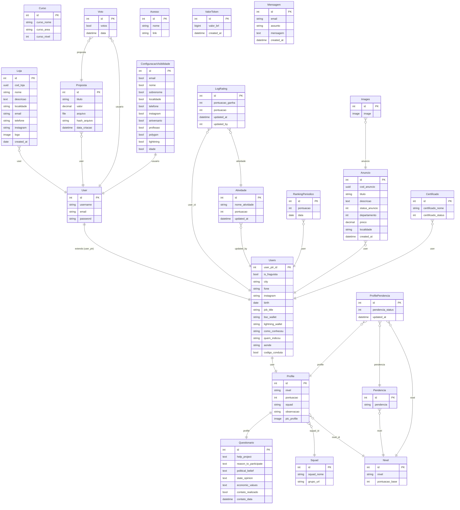

# Diagrama ER — Fraguismo

## Entidades por app

| App | Modelos |
|-----|---------|
| `members` | `Users` (extends User), `Profile`, `Squad`, `Questionario`, `ProfilePendencia` |
| `rating` | `Nivel`, `Pendencia`, `Atividade`, `LogRating` |
| `ranking` | `RankingPeriodico` |
| `marketplace` | `Anuncio`, `Images`, `Loja` |
| `cursos` | `Curso`, `Certificado` |
| `propostas` | `Proposta`, `Voto` |
| `configuracoes` | `ConfiguracaoVisibilidade` |
| `administrador` | `Acesso`, `ValorToken` |
| `site_fraguismo` | `Mensagem` |

## Observações

- `Loja`, `Proposta` e `Voto` referenciam `django.contrib.auth.models.User` diretamente; os demais usam o modelo customizado `Users`
- `ComentarioAnuncio` (`marketplace/models/comentario_anuncio.py`) tem imports faltando e não está funcional
- `Curso` não possui relacionamento com nenhuma outra entidade
